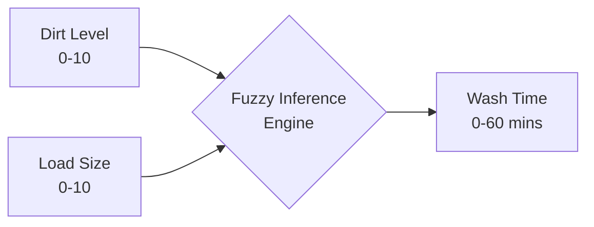

<div align="center">
  <h1>🌊 CycleSync</h1>
  <p><strong>Intelligent Fuzzy-Logic Washing Machine Dashboard</strong></p>
  
  [](#)
  [](#)
  [](#)
  [](#)
</div>

---

**CycleSync** (formerly SmartWash Pro) is a portfolio-grade fuzzy logic inference system that predicts optimal washing machine cycle times based on **Dirt Level** and **Load Size**. 

This repository features a fully interactive, single-page web dashboard built with vanilla web technologies, alongside the original MATLAB implementations.

## ✨ Features

- 🎛️ **Interactive Dashboard**: A sleek, modern single-page application replacing traditional landing pages.
- 🧠 **Live Fuzzy Inference**: Real-time Mamdani inference calculating cycle durations on the fly.
- 📊 **Dynamic Visualizations**: 
  - Real-time animated **Circular Progress Ring**.
  - 3D-style **Response Surface** projection.
  - Interactive **Membership Function** plots.
- ⚙️ **No Dependencies**: Built entirely with Vanilla JS, HTML5, and CSS3 Grid.

## 🚀 Quick Start

### Web Dashboard
No build steps or dependencies required. Simply open `index.html` in your favorite web browser!

For local development over HTTP:
```powershell
python -m http.server 8000
```
Then visit `http://localhost:8000`.

### MATLAB Implementation
Run the base MATLAB FIS:
```matlab
washing_machine_fis
```
Run the professional MATLAB dashboard:
```matlab
washing_machine_fis_pro
```

## 🏗️ System Architecture

CycleSync uses a Mamdani fuzzy inference system to calculate precise cycle times.



### 1. Linguistic Variables

| Variable | Type | Range | Membership Sets |
| :--- | :--- | :--- | :--- |
| **Dirt Level** | Input | `0-10` | Low, Medium, High |
| **Load Size** | Input | `0-10` | Small, Medium, Large |
| **Wash Time** | Output | `0-60` | Short, Medium, Long |

### 2. Rule Base

The inference engine evaluates 9 overlapping rules rather than rigid thresholds, allowing for continuous, smooth control outputs:

1. IF Dirt is **Low** AND Load is **Small** THEN Time is **Short**
2. IF Dirt is **Low** AND Load is **Medium** THEN Time is **Short**
3. IF Dirt is **Low** AND Load is **Large** THEN Time is **Medium**
4. IF Dirt is **Medium** AND Load is **Small** THEN Time is **Medium**
5. IF Dirt is **Medium** AND Load is **Medium** THEN Time is **Medium**
6. IF Dirt is **Medium** AND Load is **Large** THEN Time is **Long**
7. IF Dirt is **High** AND Load is **Small** THEN Time is **Long**
8. IF Dirt is **High** AND Load is **Medium** THEN Time is **Long**
9. IF Dirt is **High** AND Load is **Large** THEN Time is **Long**

## 🌐 Deployment

CycleSync is ready to be hosted on any static file server like **GitHub Pages**, Vercel, or Netlify.

**To deploy to GitHub Pages:**
1. Push this code to a GitHub repository.
2. Navigate to `Settings` > `Pages`.
3. Select `Deploy from a branch` and choose your `main` branch.
4. Save and wait for your dashboard to go live.
